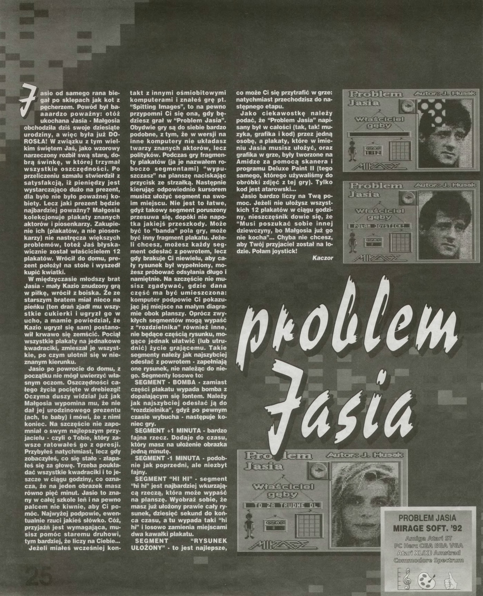

# Problem Jasia

Language: **English** | [Polish](README_PL.md)

<table>
<tr>
<td></td>
<td></td>
</tr>
</table>

## Atari

"Johnny's Problem" ("Problem Jasia") is an arcade-puzzle game released in 1993 by Mirage Software for the "small" (8-bit) Atari. The game quickly gained popularity due to its very good graphics (for its time) and extremely original and catchy music. The entire project was created by one person, then 22-year-old [Jakub Husak](http://atariki.krap.pl/index.php/Jakub_Husak).  

## PC edition (Desktop for Windows, 2022)

In 2022, it was time to create a remake of this popular game for the PC Windows platform. And so began several hours of programming a few days before leaving for vacation. Then came a dozen more hours of fixes (some during vacation, some during the return flight to the UK), a few consultations with Jakub (thx!) and others from the Atari community on [atarionline.pl](http://atarionline.pl/) forum, and the game was ready.

## Web edition (2025)
So there I was, armed with Cursor, VSCode, and my trusty AI sidekick GitHub Copilot, when I thought:
"Hey, wouldn't it be cool if AI could turn my C# Windows game into a web thing?" 🤔

My first chat with ChatGPT went something like:
"Yo, AI buddy! Can you help me turn this C# Windows Forms game into a web app?"

To my surprise, the AI didn't just nod and smile - it actually understood the game's rules and logic better than some of my human colleagues! That got me thinking: "Why not go all in and let AI help me remake the whole thing as a web page?"

What followed was a few days of what is nowadays the new buzzword "vibe-coding" - just me, a dozen or so prompts, and my AI pals turning my C# dreams into HTML, CSS, and JavaScript reality. And get this - I had never written a single line of JavaScript before! But after spending some time reading JavaScript code, I got pretty good at speaking "AI language" and asking for the right tweaks.

Plot twist: Despite being a JavaScript newbie, between me and the AI, we squashed bugs like pros! 🐛💪

👉 Play now: (online) https://problemjasia.pl

Stay tuned for a YouTube video where I'll show you the whole crazy journey of building this game with AI. Trust me, it's quite a ride! 🎮✨

Enjoy!  
Kamil Nowinski  
*Autor edycji na PC*

# Controls

- `ENTER` - Start game
- `SPACE` - pause
- `arrows` - move cursor
- `CTRL` - pull out puzzle piece
- `CTRL`+`arrows` - move puzzle piece on board
- `CTRL`+`H` - high resolution images (on/off)
- `ESC` - end / close game

# References

- https://atarionline.pl/
- https://atarionline.pl/forum/comments.php?DiscussionID=6655
- http://husak.pl/pl/muzyka/atari/
- [YouTube: Atari Retro Fan: Atari XL/XE Problem Jasia](https://youtu.be/MCXukyJk1LY)
- [YouTube: PC edition of "Johnny's Problem" (Retro) game - Problem Jasia (Atari)](https://youtu.be/GRVAMNzw568)

## Top Secret 1/1993

