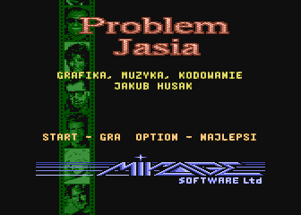
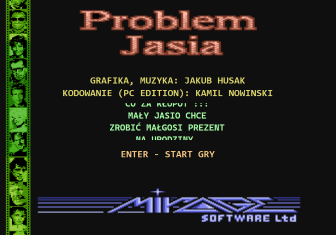
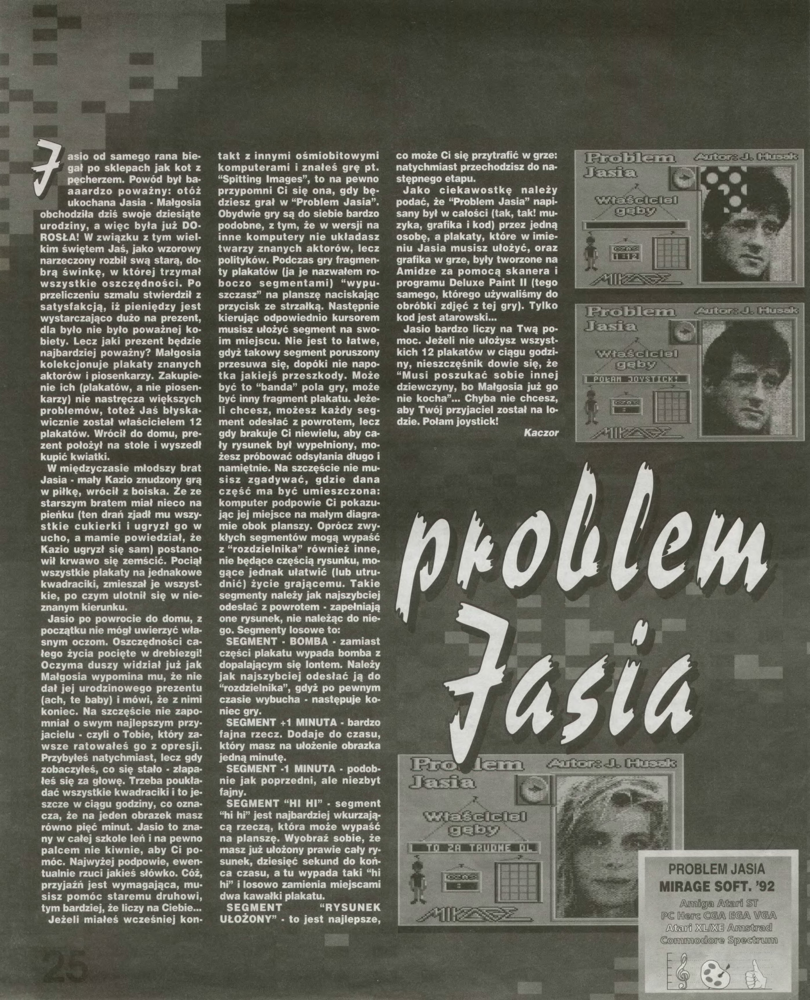

# Problem Jasia

Language: **Polish** | [English](README.md)

<table>
<tr>
<td></td>
<td></td>
</tr>
</table>

## Atari

"Problem Jasia" to gra zręcznościowo-logiczna wydana w 1993r przez firmę Mirage Software na "małe" (8-bitowe) Atari. Gra szybko zyskała na popularności przez bardzo dobrą (jak na tamte czasy) grafikę i niezwykle oryginalną i wpadającą w ucho muzykę. Całość została przygotowana przez jednego człowieka, 22-letniego wówczas [Jakuba Husaka](http://atariki.krap.pl/index.php/Jakub_Husak).  

## PC edition (Desktop for Windows,2022)

W 2022 roku przyszła pora na wykonanie remake'u tej popularnej gry na platformę PC pod Windows. I tak zaczęło się kilkugodzinne programowanie parę dni przed wylotem na wakacje. Potem jeszcze kilkanaście godzin poprawek (parę na wakacjach, parę w trakcie lotu powrotnego do UK), kilka konsultacji z Jakubem (thx!) oraz innymi ze społeczności Atari na forum [atarionline.pl](http://atarionline.pl/) i gra gotowa.

## Web edition (2025)
No i tak sobie siedzę, uzbrojony w Cursora, VSCode i mojego wiernego kumpla AI - GitHub Copilota, gdy nagle pomyślałem:
"Ej, a może by tak namówić AI, żeby przerobiło grę z C# na webową apkę?" 🤔

Moja pierwsza pogawędka z ChatGPT wyglądała mniej więcej tak:
"Siema, AI! Pomożesz mi przerobić tę grę z Windows Forms na webową?"

Ku mojemu zdziwieniu, AI nie tylko pokiwało głową - ono naprawdę ogarnęło zasady i logikę gry lepiej niż niejeden kolega po fachu! To mnie natchnęło: "A może by tak dać AI wolną rękę i pozwolić mu pomóc w przeniesieniu całości na stronę web?"

To, co nastąpiło później, to kilka dni tego, co teraz modnie nazywają "vibe-codingiem" - tylko ja, kilkanaście promptów i moje AI ziomki, zamieniające moje C#-owe marzenia w rzeczywistość HTML-a, CSS-a i JavaScriptu. I uwaga - nigdy wcześniej nie napisałem ani linijki JavaScriptu! Ale po pewnym czasie czytania kodu JS-owego, nauczyłem się całkiem nieźle gadać w "języku AI" i prosić o właściwe poprawki.

Niespodzianka: Mimo że byłem totalnym żółtodziobem w JavaScripcie, we dwójkę z AI tępiliśmy bugi jak zawodowcy! 🐛💪

Czekajcie na filmik na YouTube, gdzie pokażę Wam całą tę zwariowaną podróż tworzenia gry z AI. Będzie się działo! 🎮✨

Enjoy!  
Kamil Nowinski  
*Autor edycji na PC*

# Sterowanie

- `ENTER` - Start gry
- `SPACE` - pauza
- `strzałki` - poruszanie kursorem
- `CTRL` - wyciąganie puzzla
- `CTRL`+`strzałki` - przesuwanie puzzla na planszy
- `CTRL`+`H` - obrazki w wysokiej rozdzielczości (on/off)
- `ESC` - koniec / zamknięcie gry

# References

- https://atarionline.pl/
- https://atarionline.pl/forum/comments.php?DiscussionID=6655
- http://husak.pl/pl/muzyka/atari/
- [YouTube: Atari Retro Fan: Atari XL/XE Problem Jasia](https://youtu.be/MCXukyJk1LY)
- [YouTube: PC edition of "Johnny's Problem" (Retro) game - Problem Jasia (Atari)](https://youtu.be/GRVAMNzw568)

## Top Secret 1/1993

